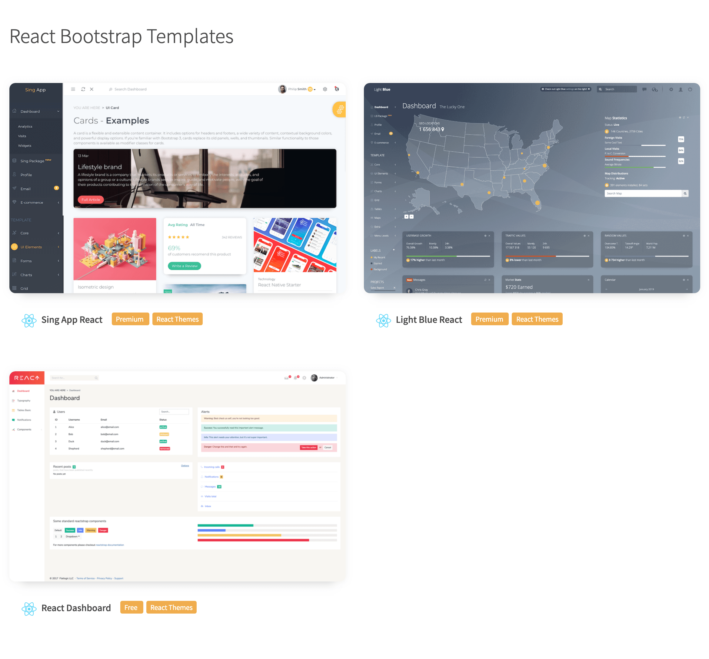

# [React Reduction - Free Admin Template Built with React and Bootstrap4](https://reduction-admin.github.io/react-reduction/)

## Preview

You can check out [live preview](https://reduction-admin.github.io/react-reduction/).

React Reduction is built on top of [Create React App](https://github.com/facebook/create-react-app), which means all features that create-react-app supports are available.

To enable basic Google Analytics page tracking, you can add "REACT_APP_GOOGLE_ANALYTICS" variable in .env(or create env.production) file. For example, `REACT_APP_GOOGLE_ANALYTICS=xxxxxx` like this.

## More Bootstrap Themes

If you want more premium or free React Bootstrap themes, you can get it [here](https://flatlogic.com/admin-dashboards?ref=w7yTz44arn)

